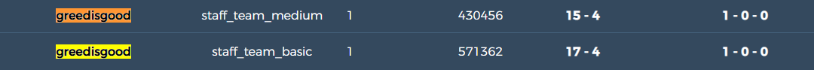
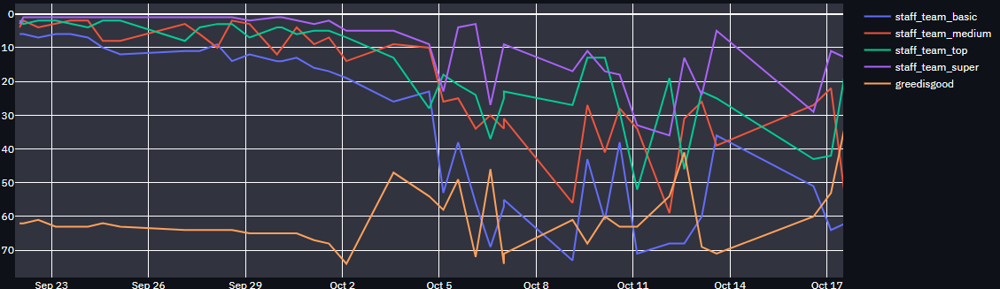

# Evolution, experimentation and evaluation

We needed a way to be able to improve our agents over time, we used various methods to test and to track the evolution of our agent. 

In the strategy section, we attempt to explain some of the decisions made by agent while making some of the choices that it did and some of the approaches that it appears to be taking. 

In our updates log, we track our agents when we thought there was interesting insight or significant progress (that we believed at the time) to be made. 

## Splendor Evaluation framework

For our evaluation plan, we mainly planned to use the tests and informal competitions that were given to us by the class. However, we found that the feedback loop was too short to make improvements. As such we supplemented this using an iterative process. We shall be referring to this as our **"Splendor evaluation framework".**

We took every improvement we made and compared it a few times against our previous agents or the previous iteartion of our agent. We standardized it to seeing if our agent won the best of 10 games against the previous iteration of our bot. This was to make sure we accounted for favourable states for an agents algorithm.

## First Agent - A* approach

The first iteration of our approach did not do too well on the fixed seeds that existed. As we were unable to beat even the most basic of bots. We found it difficult to deal with the random seeds, as our agent gave wildly varying results on various seeds. 

**Issues and bugs to fix before extending/improving upon our next agent :**

Our heuristic became very heavy and as a result was sometimes timing out. We had to handle this we examined the code where the heuristic was taking too long. It appeared to be making excessive calls in the code. 

#### Strategy observations

**Initial update:**

The agent tries to maximize it's score as early as possible. This is easy to see as it does not even really consider the the gems that it takes. It keeps taking the same gems. We did note that this does lead to a certain strategy of its own where the opponent is unable to take resources to buy certain cards (hence why we speculate this agent did well with certain seeds), however this was not the intended effect. 

**Update 2 - Implementing features and generating states**
We have implemented 4 features, namely nobles, cards, points and gem income. We can see here that our agent blindly aims to increase as many points as it can, often to its detriment.

**Update 3 - weights and decisions**
We were unable to find good results with the depth being so high, so here we tried to take the opposite approach. We trimmed down on the depth and focused on a heuristic. We doubled down and made a heavier heuristic function that took the next state in to make an expensive assumption about the state. These actions (to get to the best state) were then queued using a priority queue with the heuristic as the priority value, and then the first move of the best path available at the given state was taken. 

**Update 4 - weights and decisions**
We finally settled for our final agent, after settling on what we thought was a good set of weights. It was, however, in hindsight not the best as we based the results on the preliminary. Scores. 

We were beating the previous AI from Update 3 on average of 2 out of 3 games. Which was an improvement but not necessarily a significant one to best the staff agents (or the majority of agents).

**Prelims results**
Our agent performed poorly here and we realised that our agent worked well with certain random seeds. This was clear to see from our performance against the test bots, we were winning solely on seed luck (as we won 3 out of 4 bots in tests). 

Our agent ranked 71/88 in this instance. Which was vastly different from the performance we were seeing in the tests and that which we were seeing in the informal tournaments. 

#### Number of staff agents won in tests for each update
| update  | bots won  |
|---    |---|
|   initial - 1  | 0  |
|   2   | 0  |
|   3   | 2 (medium, basic) |
|   4   | 3 (top, medium, basic) | 

These were misattributed, as we were not beating the staff agents by much and it was mainly due to the luck built in our "strategies" for particular initial states.

## Second Agent - Q learning approach

For our Q learning approach, our aim was to outdo the previous agent we created. This was easier to do/test as we could simply run a large number of tests against our previous bot and see what sort of results we were able to achieve. We aimed to implement many of the features that we could not properly weight in our heuristic through manual trail and error by implementing it ourselves.

#### Improvements against the first agent

One of the major improvements we experienced were, that our agent was now taking cards with the intention of maximising the score previously. However we are now able to plan out more complex decisions with things such as nobles and higher valued cards in mind.

#### Strategy observations

Our final iteration of this agent seems to rely heavily on the end game, it can think of more strategies than the previous agent. It is now able to make more complex decisions. Thus, as our previous agent was able to consider more than just maximizing its score as easily as possible. This below game really highlights what we mean.

As we can see here, versus our previous A* agent we are trailing by over 10 points, however we can see that this was calcuated as the next few moves scores both nobles and highly valuable cards. But this also highlights the main flaw of the Q learning agent, it can delay its reward too much. Which results in losing the game as it is "waiting" to finish the game in a few turns towards the end. 

**Below you will find our exploration and development of this agent:**

**Initial update**

There were more than a few bugs we had to fix from our previous agent that we extended upon as we were facing time out issues. Here we describe a few of the things that we fixed up. Our previous agent had a timeout due to an issue with a heavy heuristic function.

**Update 2 - feature extension**

We have implemented 10 more features (making 14 in total). These features will be implemented over time, but they take into account both this current agent's state as well as the enemy agents state. This means that both a offensive and defensive strategy can be accounted for. Here we also started implementing the training code to find the optimal weights for the model.

Our bot is still not doing so well and is losing most of the matches. We started training our model and checking to see if the bot is doing any better against our previous agent. It's about half, half. It isn't necessarily doing better just now, as it is still not making the best moves.

**Update 3 - penalties**
This time, we are able to implement penlaties for certain actions we observed. We didn't want to incentivise taking one gem, however we didn't want to incentivse overtaking gems. As such we wrote this actions (or rather states) as undesirable. Here we were able to have penalties that led to taking the correct gems to be able to buy the cards we require, while planning ahead for other cards already existing on the board. There could be an issue if the card is either reserved before we can take it, but we were unable to test for this.

**Update 4 - progress and updates to strategy**
Our bot is now making more complex decisions with a focus on winning towards the later stages of the game. Often time it waits a little too long to make it's decision and as a result loses if the opponents focus is to greedily score as many points as they can. We will further train to see if we can account for this case.

We are not winning 3 agents with 2 that are certain wins on the current random seeds. As we can see from the image below we are winning by a fair amount of points compared to our previous agent (who was drawing with basic agent on a random seed). This along with the results we were obtaining from the informal tournaments showed promising progress for our agent.

**Update 5 - finding and testing optimal weights**
Now that we had the features we wanted to implement, we now began to run the training instance a few times in order to get the results we wanted. We trained it against our previous bot hoping to improve on it.

#### Number of staff agents won in tests for each update
| update  | bots won  |
|---    |---|
|   initial - 1  | 0  |
|   2   | 0  |
|   3   | 0  |
|   4   | 3 (top, medium, basic) |
|   5   | 3  (top, medium, basic)|

As we can see, we only started winning against bots after selecting a few of the agents we did. We were only beating the top by a marginal amount. 

### Number of staff agents won in tests for each update
Overall update across randomized competitions:

As we can see there was a dip in performance right before the prelim competion. We were falsely led by this given the favourable seed choices that gave us our wins. We see a similar trend in performance after the dip using our second agent, however, given what we observed in the test cases above. We are a little more confident that this bot will be performing better.
